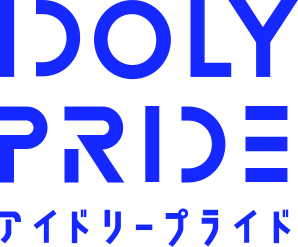

<h2 align="center">

</h2>

   

[简体中文](README.md) | [日本語](README.ja.md) | English

## Announcement

**All works in this repository are released in compliance with [_The Contents Guideline of QualiArts, Inc._](guideline.md) ([There is a archive in Wayback Machine.](https://web.archive.org/web/20210804165602/https://qualiarts.jp/guideline))**

This repository has no affiliation with QualiArts, Inc. and any third-party companies. All images, logos and trademarks are property of their respective owners.

## Introduce

The maintainers of this repository have made all the logos that appear in the Project IDOLY PRIDE series into SVG, so that managers can use them freely.

## Project schedule

[Status](Status.md)

## License

[Creative Commons Attribution-NonCommercial 4.0 International](http://creativecommons.org/licenses/by-nc/4.0/)

