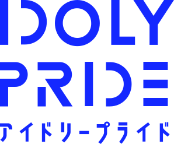

<h2 align="center">

</h2>

   

[简体中文](README.md) | 日本語 | [English](README.en.md)

## 声明

**本リポジトリのすべての作品は、[「株式会社 QualiArts 著作物利用ガイドライン」](guideline.md)（[ウェイバックマシンのバックアップ](https://web.archive.org/web/20210804165602/https://qualiarts.jp/guideline)）を遵守して配布されています。**

このリポジトリは株式会社 QualiArts やどの第三者会社とも関係ありません。すべての画像、ロゴ、商標はそれぞれの所有者の財産です。

## 紹介

このプロジェクトは、Project IDOLY PRIDE シリーズに登場するすべてのロゴを SVG に作成し、各マネージャーが自由に利用できるようにすることを目的としています。

## プロジェクトの進度

[Status](Status.md)

## ライセンス

[クリエイティブ・コモンズ 表示 - 非営利 4.0 国際 ライセンス](http://creativecommons.org/licenses/by-nc/4.0/)

